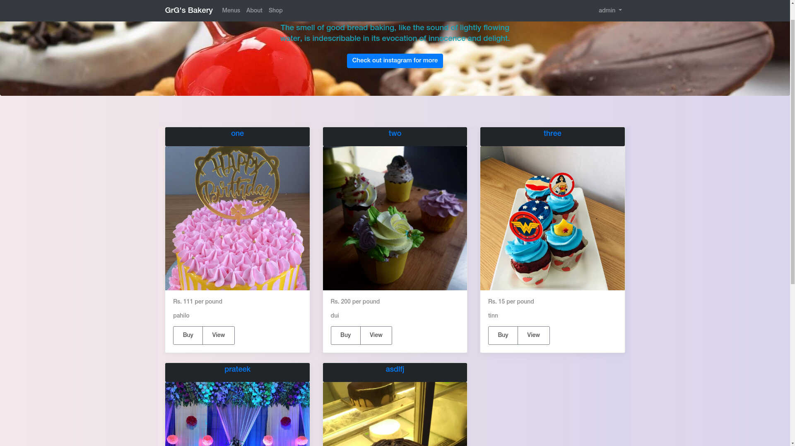

 
  <h3 align="center">Bakery Website</h3>

  

    A web application designed for bakery advertisement, marketing and sale of products.
     
    <a target="_blank" href="https://grgbakery.000webhostapp.com">View Demo</a>
    ·
    <a href="https://github.com/diwasx/bakery/issues">Report Bug</a>
  

<!-- TABLE OF CONTENTS -->
## Table of Contents

* [About the Project](#about-the-project)
  * [Built With](#built-with)
* [Contributing](#contributing)
* [License](#license)
* [Let's Get Social](#lets-get-social)
* [Contact](#contact)
* [Acknowledgements](#acknowledgements)

<!-- ABOUT THE PROJECT -->
## About The Project

Everything is being digitized and online on regular basis. This digitization also takes place at competitive market areas where shops and stores are taking their market online. Bakery shops are also one of the popular business in market. Sometimes people can’t directly go to bakery and make their order maybe because of unavailability of time or maybe due to some urgency.

### Built With

* [Laravel](https://laravel.com/)
* [MySQL](https://www.mysql.com/)
* [Bootstrap](https://getbootstrap.com)
* [JQuery](https://jquery.com)

<!-- CONTRIBUTING -->
## Contributing

Contributions are what make the open source community such an amazing place to be learn, inspire, and create. Any contributions you make are **greatly appreciated**.

1. Fork the Project
2. Create your Feature Branch (`git checkout -b feature/AmazingFeature`)
3. Commit your Changes (`git commit -m 'Add some AmazingFeature`)
4. Push to the Branch (`git push origin feature/AmazingFeature`)
5. Open a Pull Request

<!-- LICENSE -->
## License

Distributed under the MIT License. See `LICENSE` for more information.

<!-- LET'S GET SOCIAL -->
## Let's Get Social

* [Facebook](https://facebook.com/diwas.ale)
* [Github](https://github.com/diwasx)

<!-- CONTACT -->
## Contact

Diwash Ale - diwasx@gmail.com

Project Link: [https://github.com/diwasx/bakery](https://github.com/diwasx/bakery)

<!-- ACKNOWLEDGEMENTS -->
## Acknowledgements
* [Youtube series](https://www.youtube.com/playlist?list=PLillGF-RfqbYhQsN5WMXy6VsDMKGadrJ- )
* [Model View Controler](https://en.wikipedia.org/wiki/Model-view-controller)
* [Laravel Documentation](https://laravel.com/docs/5.8/)
* [Bootstrap Examples](https://getbootstrap.com/docs/4.0/examples/)
